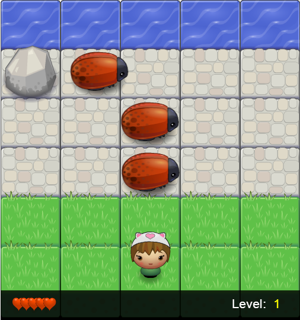
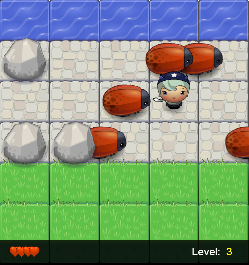
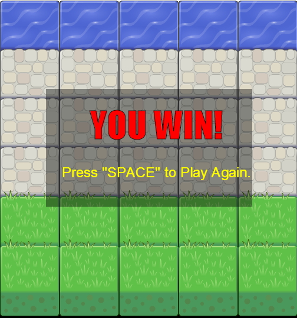

UDACITY-前端进阶-Project1

**街机游戏克隆项目**

## 项目介绍
    
    游戏通过HTML5 Canvas对图像和文字进行绘制，使用Javascript语言对游戏进行开发。实现了经典游戏“青蛙过河”的复刻。
    
    玩家通过控制画面中的人物移动，使其顺利通过画面中的石头路面，达到顶端的河面即顺利完成一关，画面中出现的石头会阻碍玩家移动，画面出现移动的瓢虫会使玩家丢失一条生命，并随机返回草坪的某一位置。游戏共7关。玩家共有5条生命。
    
## 运行方式

    游戏无需编译或安装任何插件，只需导入普通WEB服务器，通过浏览器正常访问即可。以下为在CENTOS 7环境下使用NGNIX WEB服务器为例。
    
- NGINX 服务器配置

在/etc/nginx/conf.d/目录中增加游戏项目配置 game.conf。
```
server {
    listen       80;
    server_name  127.0.0.1;  # 游戏服务器IP或域名

    location / {
        root   /home/httpd/html/game; # 游戏代码所在目录
        index  index.html index.htm;
    }

    error_page   500 502 503 504  /50x.html;
    location = /50x.html {
        root   /usr/share/nginx/html;
    }

}

```

- 游戏代码导入
    
    根据nginx中配置，代码目录位于：/home/httpd/html/game，进入该目录后通过git工具导入代码。

```
# mkdir /home/httpd/html/game/ -p
# git clone https://github.com/microsea/arcade-game-clone /home/httpd/html/game/
```

- 运行游戏
    打开浏览器访问地址 http://127.0.0.1/ (根据NGINX中设置的服务器地址访问即可。)

- 游戏截图

</img>
</img>
</img>

### 游戏操作
- 通过 上 下 左 右 四个方向键控制人物
- 玩家生命全部耗尽或通过全部关卡按空格键可重新开始游戏